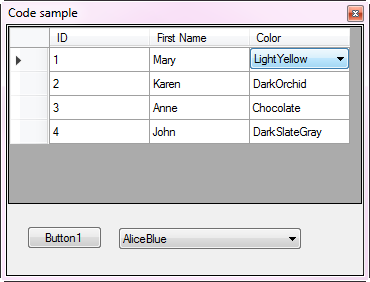

    

This example shows how to load from SQL-Server database into a DataGridView DataGridViewComboBox column along with a method to dynamically add new items to the DataGridViewComboBox which is stored in a database table.

Coded with Visual Studio 2017

For those using earlier versions of Visual Studio consider this code sample view only, study the code and adapt to your version of Visual Studio.

    

