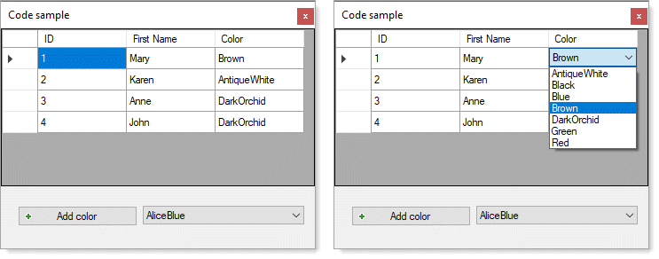

# About

This example shows how to load from SQL-Server database into a DataGridView DataGridViewComboBox column along with a method to dynamically add new items to the DataGridViewComboBox which is stored in a database table.

:heavy_check_mark: Coded with `Visual Studio 2017` then opened in `Visual Studio 2019`

:bulb: Consider using a BindingList in tangent with a BindingSource

